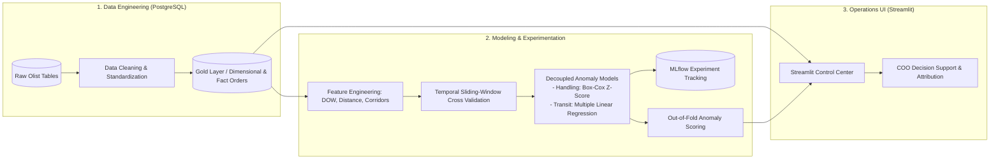

# 📦 Marketplace Logistics & SLA Bottleneck Detection

> An end-to-end decision-support and anomaly attribution system for marketplace operations (Olist Brazil).


---

## 🎯 Executive Summary & The Operational Problem

[Olist](https://olist.com/) is a Brazilian marketplace aggregator. Sellers list their products on the platform, and Olist distributes them across major e-commerce channels under the unified "Olist Store" account. 

For the **Chief Operating Officer (COO)** managing platform operations, the core challenge is **fulfillment reliability and Service Level Agreement (SLA) compliance**. 

When an order arrives late, the operations team faces a fundamental attribution problem:
* **Was the merchant slow to fulfill and hand over the package?** (*Seller Handling Bottleneck*)
* **Or was the logistics partner delayed in transit?** (*Carrier Route Bottleneck*)

Global delivery metrics conflate these two phases. This project provides an **end-to-end analytics and anomaly detection system** that decouples handling duration from carrier transit duration, attributing delays to their true root causes to empower targeted operational interventions.

---

## 🖥️ Interactive Operations Dashboard

The Streamlit decision-support application allows operations executives to monitor high-level SLA health, inspect delivery time compositions, and isolate handling vs. carrier anomalies across different time horizons.


*(A full HD recording is also available at [`assets/dashboard_demo.mp4`](assets/dashboard_demo.mp4))*

---

## 📊 Operations Framework & Performance Baselines

A high-impact operational dashboard must answer three continuous questions:
1. **Descriptive:** Are we winning or losing?
2. **Diagnostic:** Why is it happening?
3. **Prescriptive:** What operational actions are required?

### Core Logistics Metrics & Thresholds

| Metric | Business Definition | Target / Baseline | Operational Impact |
| :--- | :--- | :--- | :--- |
| **On-Time Delivery (OTD) Rate** | % of orders delivered within estimated SLA | **>95% Winning**<br>90–95% Acceptable<br>**<90% Losing** | Directly drives customer satisfaction, repeat purchases, and dispute rates. |
| **Seller Dispatch Compliance** | Duration from payment approved to carrier handover (`handling_days`) | Evaluated via anomaly models conditioned on order volume & surface area | Flags non-compliant sellers needing SLA buffer adjustments or merchant ops intervention. |
| **Carrier Net Transit Time** | Duration from carrier handover to customer delivery (`transit_days`) | Evaluated via regression models conditioned on distance, state corridor, and volume | Identifies failing regional routes and logistics partner underperformance. |
| **Freight Ratio** | $\frac{\text{Freight Value}}{\text{Product Value} + \text{Freight Value}}$ | **<12% Winning**<br>12–15% Acceptable<br>**>15% Losing** | Balances customer conversion vs. platform margin. |

---

## 🏗️ System Architecture & Machine Learning Pipeline



### 1. Data Engineering & Layered SQL
* Structured PostgreSQL schema with DDL definitions, rigorous data cleaning, and business fact/dimensional tables (`gold.fct_orders`, `gold.monthly_logistics_metrics`).
* Computes geospatial geodesic distance between seller and customer zip code coordinates.

### 2. Time-Aware Experimentation & Modeling
* **Leakage-Free Validation:** Logistics data suffers from temporal autocorrelation and seasonality. We employ a **monthly sliding-window cross-validation** scheme to evaluate models sequentially without lookahead bias.
* **Decoupled Anomaly Detection:**
  * **Handling Duration:** Modeled via group-stratified Box-Cox transformed Z-scores and empirical quantiles conditioned on seller state and dispatch day-of-week.
  * **Carrier Transit Duration:** Modeled via multiple linear regression (MLR) incorporating geographic distance, within-state vs. interstate logistics corridors, and dimensional package attributes.
* **Experiment Management:** Fully modularized configurations using **Hydra** (`configs/`) with automated metric logging to **MLflow** (`mlflow.db`).
* **Out-of-Fold (OOF) Inference:** Predictions generated out-of-fold are exported to `data/processed/` for downstream integration into operational dashboards.

### 3. Application Layer
* High-performance dashboard built with **Streamlit** and **Plotly**.
* Provides single-click cohort switching (Monthly, Quarterly, Yearly) and a **Split View** comparing On-Time vs. Late delivery cohorts.

---

## 📁 Repository Structure

```
├── app.py                     # Streamlit operations dashboard
├── assets/                    # Screenshots, demo GIF, and video assets
│   ├── dashboard_preview.png
│   ├── dashboard_demo.gif
│   └── dashboard_demo.mp4
├── configs/                   # Hydra hierarchical configuration system
│   ├── config.yaml            # Base experiment config
│   ├── data/                  # Dataset definitions (handling_days, transit_days)
│   ├── experiment/            # Experiment overrides (boxcox, quantiles, MLR)
│   ├── features/              # Feature sets
│   ├── model/                 # Model architectures
│   └── split/                 # Temporal sliding window splitters
├── data/                      # Local data directory (raw and processed OOF scores)
├── evaluate.py                # Evaluation runner for test splits
├── notebook/                  # Exploratory and prototyping notebooks
├── scripts/                   # Automation scripts (export OOF, run all experiments)
├── sql/                       # PostgreSQL DDL, cleaning scripts, and marts
│   ├── 01_ddl_setup.sql
│   ├── 02_data_cleaning.sql
│   └── 03_build_order_delivery_dataset.sql
├── src/                       # Production Python package
│   ├── data/                  # Data loaders and schemas
│   ├── evaluation/            # Custom evaluation metrics
│   ├── features/              # Feature engineering pipelines
│   ├── models/                # Statistical & ML estimators
│   ├── tracking/              # MLflow integration utilities
│   └── utils/                 # Resolvers and helpers
└── train.py                   # Hydra training entrypoint
```

---

## 🚀 Quickstart

### 1. Environment Setup
```bash
# Clone the repository
git clone https://github.com/ProProcer/olist-ecommerce-analytics.git
cd olist-ecommerce-analytics

# Install dependencies
pip install -r requirements.txt
```

### 2. Run Modeling Experiments (Hydra + MLflow)
```bash
# Run default experiment
python train.py

# Run a specific experiment override
python train.py experiment=final_handling
python train.py experiment=final_transit

# Launch MLflow UI to view experiment runs
mlflow ui --backend-store-uri sqlite:///mlflow.db
```

### 3. Launch Operations Dashboard
```bash
streamlit run app.py
```