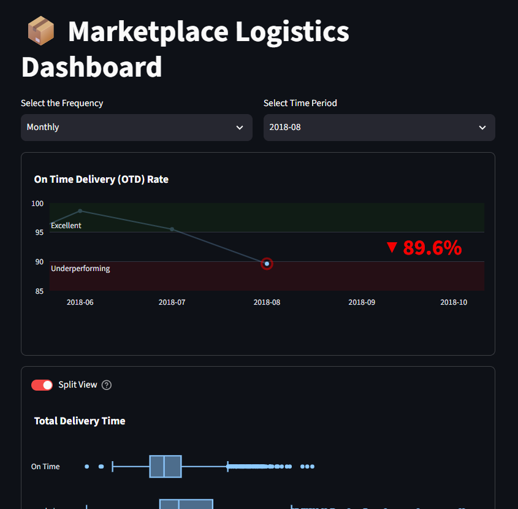
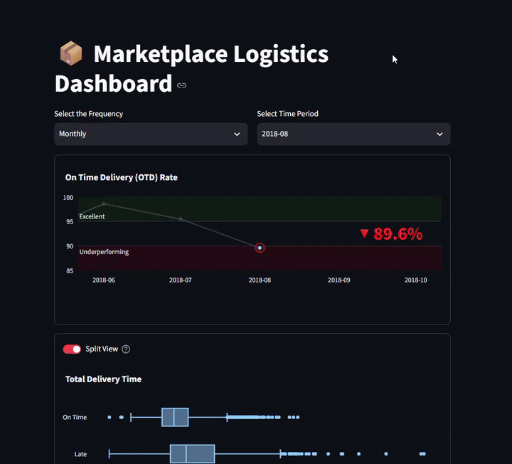
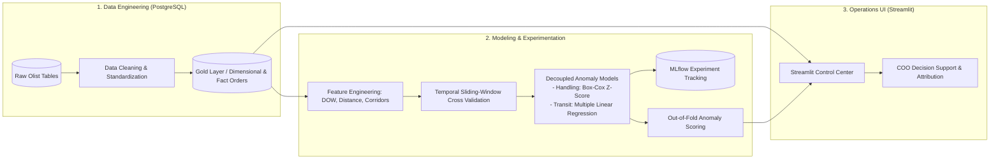

# 📦 Marketplace Logistics & SLA Bottleneck Detection

> An end-to-end decision-support and anomaly attribution system for marketplace operations (Olist Brazil).



---

## 🎯 Executive Summary & The Operational Problem

[Olist](https://olist.com/) is a Brazilian marketplace aggregator. Sellers list their products on the platform, and Olist distributes them across major e-commerce channels under the unified "Olist Store" account. 

For the **Chief Operating Officer (COO)** managing platform operations, the core challenge is **fulfillment reliability and Service Level Agreement (SLA) compliance**. 

When an order arrives late, the operations team faces a fundamental attribution problem:
* **Was the merchant slow to fulfill and hand over the package?** (*Seller Handling Bottleneck*)
* **Or was the logistics partner delayed in transit?** (*Carrier Route Bottleneck*)

Global delivery metrics conflate these two phases. This project provides an **end-to-end analytics and anomaly detection system** that decouples handling duration from carrier transit duration, attributing delays to their true root causes to empower targeted operational interventions.

---

## 🖥️ Interactive Operations Dashboard

The Streamlit decision-support application allows operations executives to monitor high-level SLA health, inspect delivery time compositions, and isolate handling vs. carrier anomalies across different time horizons.



*(A full HD recording is also available at [`assets/dashboard_demo.mp4`](assets/dashboard_demo.mp4))*

---

## 📊 Operations Framework & Performance Baselines

A high-impact operational dashboard must answer three continuous questions:
1. **Descriptive:** Are we winning or losing?
2. **Diagnostic:** Why is it happening?
3. **Prescriptive:** What operational actions are required?

### Core Logistics Metrics & Operational Modules

The dashboard tracks five core operational modules reflecting the real-time fulfillment health of the marketplace:

| Module | Specific Metric | Operational Definition | Dashboard Benchmark / Behavior | Actionable Insight |
| :--- | :--- | :--- | :--- | :--- |
| **SLA Health** | **On-Time Delivery (OTD) Rate** | $\frac{\sum \text{on\_time\_orders}}{\sum \text{total\_orders}} \times 100$ | **>95% Excellent** (Green)<br>90–95% Normal<br>**<90% Underperforming** (Red) | High-level fulfillment pulse; immediately signals when platform delivery promises to customers are breaking down. |
| **Fulfillment Composition** | **Handling vs. Transit Duration** | Average days in **Handling** (payment approved $\rightarrow$ carrier handover) vs. **Transit** (carrier handover $\rightarrow$ customer delivery) | Stratified by **On-Time** vs. **Late Delivery** cohorts | Dissects delivery cycle time to show whether delays stem from merchant dispatch lag or postal transit times. |
| **Root-Cause Attribution** | **Anomaly Proportion Engine** | Order distribution across 4 mutually exclusive states: **Fine**, **Handling anomaly**, **Carrier anomaly**, and **Both anomalies** | Model-driven Out-of-Fold (OOF) scoring evaluated against statistical & regression baselines | Eliminates operational guesswork by directly attributing delivery failures to specific merchants or logistics partners. |
| **Unit Economics** | **Freight Rate Efficiency** | • **Rate by Weight:** $\frac{\sum \text{Freight Value}}{\sum \text{Weight (kg)}}$ ($\text{R\$} / \text{kg}$)<br>• **Rate by Volume:** $\frac{\sum \text{Freight Value}}{\sum \text{Volume (m}^3\text{)}}$ ($\text{R\$} / \text{m}^3$) | Period-over-period delta comparison with inverted cost coloring | Identifies freight cost inflation per unit of physical weight and volume across quarters. |
| **Pipeline Friction** | **Non-Delivered Order Breakdown** | Count distribution of in-flight and unfulfilled orders (`approved`, `processing`, `invoiced`, `shipped`, `unavailable`, `canceled`) | Non-delivered order count vs. total approved orders (`Count: X / Y`) | Detects backlogs before packages enter the postal network, and monitors cancellation/unavailability rates. |

---

## 🏗️ System Architecture & Machine Learning Pipeline



### 1. Data Engineering & Layered SQL
* Structured PostgreSQL schema with DDL definitions, rigorous data cleaning, and business fact/dimensional tables (`gold.fct_orders`, `gold.monthly_logistics_metrics`).
* Computes geospatial geodesic distance between seller and customer zip code coordinates.

### 2. Time-Aware Experimentation & Modeling
* **Leakage-Free Validation:** Logistics data suffers from temporal autocorrelation and seasonality. We employ a **monthly sliding-window cross-validation** scheme to evaluate models sequentially without lookahead bias.
* **Decoupled Anomaly Detection:**
  * **Handling Duration:** Modeled via group-stratified Box-Cox transformed Z-scores and empirical quantiles conditioned on seller state and dispatch day-of-week.
  * **Carrier Transit Duration:** Modeled via multiple linear regression (MLR) incorporating geographic distance, within-state vs. interstate logistics corridors, and dimensional package attributes.
* **Experiment Management:** Fully modularized configurations using **Hydra** (`configs/`) with automated metric logging to **MLflow** (`mlflow.db`).
* **Out-of-Fold (OOF) Inference:** Predictions generated out-of-fold are exported to `data/processed/` for downstream integration into operational dashboards.

### 3. Application Layer
* High-performance dashboard built with **Streamlit** and **Plotly**.
* Provides single-click cohort switching (Monthly, Quarterly, Yearly) and a **Split View** comparing On-Time vs. Late delivery cohorts.

---

## 📁 Repository Structure

```
├── app.py                     # Streamlit operations dashboard
├── assets/                    # Screenshots, demo GIF, and video assets
│   ├── dashboard_preview.png
│   ├── dashboard_demo.gif
│   └── dashboard_demo.mp4
├── configs/                   # Hydra hierarchical configuration system
│   ├── config.yaml            # Base experiment config
│   ├── data/                  # Dataset definitions (handling_days, transit_days)
│   ├── experiment/            # Experiment overrides (boxcox, quantiles, MLR)
│   ├── features/              # Feature sets
│   ├── model/                 # Model architectures
│   └── split/                 # Temporal sliding window splitters
├── data/                      # Local data directory (raw and processed OOF scores)
├── evaluate.py                # Evaluation runner for test splits
├── notebook/                  # Exploratory and prototyping notebooks
├── scripts/                   # Automation scripts (export OOF, run all experiments)
├── sql/                       # PostgreSQL DDL, cleaning scripts, and marts
│   ├── 01_ddl_setup.sql
│   ├── 02_data_cleaning.sql
│   └── 03_build_order_delivery_dataset.sql
├── src/                       # Production Python package
│   ├── data/                  # Data loaders and schemas
│   ├── evaluation/            # Custom evaluation metrics
│   ├── features/              # Feature engineering pipelines
│   ├── models/                # Statistical & ML estimators
│   ├── tracking/              # MLflow integration utilities
│   └── utils/                 # Resolvers and helpers
└── train.py                   # Hydra training entrypoint
```

---

## 🚀 Quickstart

### 1. Environment Setup
```bash
# Clone the repository
git clone https://github.com/ProProcer/olist-ecommerce-analytics.git
cd olist-ecommerce-analytics

# Install dependencies
pip install -r requirements.txt
```

### 2. Run Modeling Experiments (Hydra + MLflow)
```bash
# Run default experiment
python train.py

# Run a specific experiment override
python train.py experiment=final_handling
python train.py experiment=final_transit

# Launch MLflow UI to view experiment runs
mlflow ui --backend-store-uri sqlite:///mlflow.db
```

### 3. Launch Operations Dashboard
```bash
streamlit run app.py
```