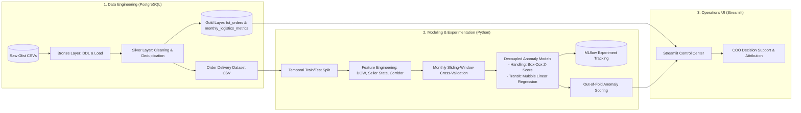

# 📦 Marketplace Logistics & SLA Bottleneck Detection

> An end-to-end decision-support and anomaly attribution system for marketplace operations (Olist Brazil).


---

## 🎯 Executive Summary & The Operational Problem

[Olist](https://olist.com/) is a Brazilian marketplace aggregator. Sellers list their products on the platform, and Olist distributes them across major e-commerce channels under the unified "Olist Store" account. 

For the **Chief Operating Officer (COO)** managing platform operations, the core challenge is **fulfillment reliability and Service Level Agreement (SLA) compliance**. 

When an order arrives late, the operations team faces a fundamental attribution problem:
* **Was the merchant slow to fulfill and hand over the package?** (*Seller Handling Bottleneck*)
* **Or was the logistics partner delayed in transit?** (*Carrier Route Bottleneck*)

Global delivery metrics conflate these two phases. This project provides an **end-to-end analytics and anomaly detection system** that decouples handling duration from carrier transit duration, attributing delays to their true root causes to empower targeted operational interventions.

---

## 🖥️ Interactive Operations Dashboard

The Streamlit decision-support application allows operations executives to monitor high-level SLA health, inspect delivery time compositions, and isolate handling vs. carrier anomalies across different time horizons.


*(A full HD recording is also available at [`assets/dashboard_demo.mp4`](assets/dashboard_demo.mp4))*

---

## 📊 Operations Framework & Performance Baselines

A high-impact operational dashboard must answer three continuous questions:
1. **Descriptive:** Are we winning or losing?
2. **Diagnostic:** Why is it happening?
3. **Prescriptive:** What operational actions are required?

### Core Logistics Metrics & Operational Modules

The dashboard tracks five core operational modules reflecting the real-time fulfillment health of the marketplace:

| Module | Specific Metric | Operational Definition | Dashboard Benchmark / Behavior | Actionable Insight |
| :--- | :--- | :--- | :--- | :--- |
| **SLA Health** | **On-Time Delivery (OTD) Rate** | On-Time Orders ÷ Total Orders × 100 | **>95% Excellent** (Green)<br>90–95% Normal<br>**<90% Underperforming** (Red) | High-level fulfillment pulse; immediately signals when platform delivery promises to customers are breaking down. |
| **Fulfillment Composition** | **Handling vs. Transit Duration** | Average days in **Handling** (payment approved → carrier handover) vs. **Transit** (carrier handover → customer delivery) | Stratified by **On-Time** vs. **Late Delivery** cohorts | Dissects delivery cycle time to show whether delays stem from merchant dispatch lag or postal transit times. |
| **Root-Cause Attribution** | **Anomaly Proportion Engine** | Order distribution across 4 mutually exclusive states: **Fine**, **Handling anomaly**, **Carrier anomaly**, and **Both anomalies** | Model-driven Out-of-Fold (OOF) scoring evaluated against statistical & regression baselines | Eliminates operational guesswork by directly attributing delivery failures to specific merchants or logistics partners. |
| **Unit Economics** | **Freight Rate Efficiency** | • **Rate by Weight:** Freight Value ÷ Weight (kg), in R$/kg<br>• **Rate by Volume:** Freight Value ÷ Volume (m³), in R$/m³ | Period-over-period delta comparison with inverted cost coloring | Identifies freight cost inflation per unit of physical weight and volume across quarters. |
| **Pipeline Friction** | **Non-Delivered Order Breakdown** | Count distribution of in-flight and unfulfilled orders (`approved`, `processing`, `invoiced`, `shipped`, `unavailable`, `canceled`) | Non-delivered order count vs. total approved orders (`Count: X / Y`) | Detects backlogs before packages enter the postal network, and monitors cancellation/unavailability rates. |

---

## 🏗️ System Architecture & Machine Learning Pipeline



### 1. Data Engineering & Layered SQL
* Structured PostgreSQL pipeline with DDL definitions and rigorous data cleaning:
  * **Bronze** (`sql/01_ddl_setup.sql`): raw Olist tables loaded as-is.
  * **Silver** (`sql/02_data_cleaning.sql`): deduplicated, typed, and constraint-enforced tables (PK/FK). Deduplication decisions are justified in `sql/diagnostics.sql`.
  * **Dataset query** (`sql/03_build_order_delivery_dataset.sql`): order-level dataset with geodesic (Haversine) seller–customer distance, package dimensions, and handling/transit/total durations, exported to CSV via `scripts/export_dataset.py`.
* The **Gold layer** (`sql/04_build_gold_layer.sql`) builds `gold.fct_orders` (order-level delivery durations and on-time flags) and `gold.monthly_logistics_metrics` (monthly KPIs), which the dashboard reads directly from PostgreSQL.

### 2. Time-Aware Experimentation & Modeling
* **Leakage-Free Validation:** Logistics data suffers from temporal autocorrelation and seasonality. We employ a **monthly sliding-window cross-validation** scheme (3 training months, 1 test month per fold) to evaluate models sequentially without lookahead bias and produce Out-of-Fold (OOF) scores.
* **Decoupled Anomaly Detection:**
  * **Handling Duration (final model):** Box-Cox transformed Z-scores, stratified by **seller state and dispatch day-of-week** groups, flagging orders above the group-specific upper bound. Benchmarked against t-score, lognormal, and empirical-quantile baselines in both grouped and day-of-week-only variants.
  * **Carrier Transit Duration (final model):** Multiple linear regression on **dispatch day-of-week and within-state corridor indicators**, with t-distribution prediction intervals for anomaly thresholds. Log-transformed target and day-of-week × corridor interaction variants were also explored.
* **Evaluation Metrics:** Alpha absolute error (primary), RMSE, median absolute error, and outlier fraction — logged per fold, as cross-validation mean/std, and on OOF predictions.
* **Experiment Management:** Fully modularized configurations using **Hydra** (`configs/`) with automated metric and config-artifact logging to **MLflow** (`mlflow.db`).
* **Holdout Evaluation:** `evaluate.py` re-runs the chosen models on the temporally separated test split (retraining on the 3 months preceding the test window) and logs results under a `_test` suffix.
* **Out-of-Fold (OOF) Inference:** Predictions generated out-of-fold are exported by `scripts/export_oof_predictions.py` to `data/processed/` for downstream integration into the operational dashboard.

### 3. Application Layer
* Dashboard built with **Streamlit** and **Plotly**, querying PostgreSQL through `st.connection`.
* Provides single-click cohort switching (Monthly, Quarterly, Yearly) and a **Split View** comparing On-Time vs. Late delivery cohorts, with delivery-time composition and anomaly attribution per cohort.

---

## 📁 Repository Structure

```
├── .env.example               # Template for local DB credentials (copy to .env)
├── .streamlit/
│   └── secrets.toml.example   # Template for dashboard DB connection (copy to secrets.toml)
├── app.py                     # Streamlit operations dashboard
├── assets/                    # Dashboard screenshots and demo recording assets
├── configs/                   # Hydra hierarchical configuration system
│   ├── config.yaml            # Base experiment config
│   ├── data/                  # Dataset definitions (handling_days, transit_days)
│   ├── evaluator/             # Evaluation metric configurations
│   ├── experiment/            # Experiment overrides (baselines + final_handling / final_transit)
│   ├── features/              # Feature sets (dow, dow_seller_state, corridor, interaction)
│   ├── model/                 # Model architectures (zscore, tscore, quantile, MLR, log-MLR...)
│   ├── split/                 # Temporal sliding-window splitter
│   ├── tracker/               # MLflow and console tracking configurations
│   └── validator/             # Cross-validator configuration
├── data/
│   ├── raw/                   # Original Olist CSVs
│   └── processed/             # Delivery dataset, temporal train/test splits, OOF scores
├── evaluate.py                # Holdout test-split evaluation runner
├── notebook/                  # Modeling exploration notebooks (handling & transit days)
├── outputs/                   # Generated Hydra run artifacts (gitignored)
├── requirements.txt           # Python dependencies
├── scripts/                   # Automation scripts
│   ├── export_dataset.py      # Export SQL dataset query to CSV
│   ├── split_dataset.py       # Temporal train/test split
│   ├── export_oof_predictions.py  # Export OOF scores for the dashboard
│   └── run_all_experiments.sh # Run default + every experiment config
├── sql/                       # PostgreSQL pipeline
│   ├── 01_ddl_setup.sql       # Bronze: raw table DDL
│   ├── 02_data_cleaning.sql   # Silver: cleaning, deduplication, constraints
│   ├── 03_build_order_delivery_dataset.sql  # Order-level dataset query
│   ├── 04_build_gold_layer.sql  # Gold: fct_orders & monthly_logistics_metrics
│   └── diagnostics.sql        # Queries justifying cleaning decisions
├── src/                       # Production Python package
│   ├── data/                  # Data loaders and transforms
│   ├── evaluation/            # Cross-validator, splitters, custom metrics
│   ├── features/              # Feature engineering pipelines
│   ├── models/                # Group estimators, MLR with prediction intervals, wrappers
│   ├── schemas/               # Prediction and validation result dataclasses
│   ├── tracking/              # MLflow and console trackers
│   └── utils/                 # Hydra resolvers and helpers
└── train.py                   # Hydra training entrypoint
```

---

## 🚀 Quickstart

### 1. Environment Setup
```bash
# Clone the repository
git clone https://github.com/ProProcer/olist-ecommerce-analytics.git
cd olist-ecommerce-analytics

# Install dependencies
pip install -r requirements.txt
```

### 2. Prepare the Data (PostgreSQL)
```bash
# Download the raw CSVs from Kaggle (Brazilian E-Commerce Public Dataset by Olist):
#   https://www.kaggle.com/datasets/olistbr/brazilian-ecommerce
# Place them in data/raw/, then create the bronze tables and load the CSVs into them
psql -d olist_ecommerce -f sql/01_ddl_setup.sql

# Clean into the silver schema
psql -d olist_ecommerce -f sql/02_data_cleaning.sql

# Build the gold layer consumed by the dashboard
psql -d olist_ecommerce -f sql/04_build_gold_layer.sql

# Export the order-level dataset (requires DB_URL in .env)
cp .env.example .env   # then fill in your PostgreSQL credentials
python scripts/export_dataset.py \
    -i sql/03_build_order_delivery_dataset.sql \
    -o data/processed/order_delivery_dataset.csv

# Temporal train/test split (cutoff 2018-01-01)
python scripts/split_dataset.py \
    --csv_path data/processed/order_delivery_dataset.csv \
    --datetime_column order_approved_at \
    --cutoff_date 01-01-2018 \
    --name order_delivery_dataset
```

### 3. Run Modeling Experiments (Hydra + MLflow)
```bash
# Run the default experiment, or a specific experiment override
python train.py
python train.py experiment=final_handling
python train.py experiment=final_transit

# Evaluate the chosen models on the holdout test split
python evaluate.py experiment=final_handling
python evaluate.py experiment=final_transit

# Run the default config plus every experiment config
bash scripts/run_all_experiments.sh

# Launch MLflow UI to view experiment runs
mlflow ui --backend-store-uri sqlite:///mlflow.db
```

### 4. Export OOF Anomaly Scores for the Dashboard
```bash
python -m scripts.export_oof_predictions experiment=final_handling
python -m scripts.export_oof_predictions experiment=final_transit
```

### 5. Launch Operations Dashboard
The dashboard connects to a PostgreSQL database containing the `gold.fct_orders` and `gold.monthly_logistics_metrics` tables; connection settings live in `.streamlit/secrets.toml`.
```bash
cp .streamlit/secrets.toml.example .streamlit/secrets.toml   # then fill in your credentials
streamlit run app.py
```
